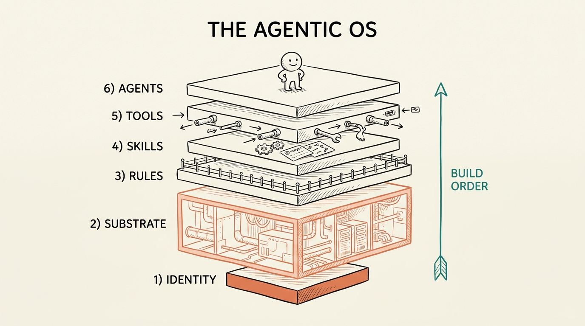

# /os-coach

A Claude Code skill that hand-holds a non-technical person through building their own **agentic OS**, one layer at a time, in whatever folder they run it in. It does the technical work for them. They make the decisions.

The whole thing rests on one idea: **an agentic OS is mostly plumbing. The model is the cheap 20%.** You cannot talk to your data if the back of house is a mess, so this skill builds the back of house first, then layers capability on top.

<p align="center">
  
</p>

> Six layers, built from the ground up. Identity is the foundation, Substrate (the back of house) is the biggest layer, and Agents sit on top once everything beneath them is solid.

---

## What it does

You run `/os-coach` inside any folder and tell it your goal. The skill:

1. **Starts a real OS** in that folder, captures your goal in your own words, and remembers exactly where you are between sessions in a `memory.md` file.
2. **Coaches one layer at a time.** It asks 2 to 3 plain-English questions, waits for your answer, then builds the actual files and folders for you and explains what it made and why.
3. **Never talks like a manual.** No jargon. When a technical word is unavoidable it gets one short sentence and an everyday analogy. It assumes you have never opened a terminal.
4. **Refuses to be generic.** Every suggestion is grounded in your real goal and what is actually in your folder right now, not boilerplate advice.
5. **Audits on demand.** Ask it to assess and it scores all six layers against your stated goal, gives you the three highest-leverage next moves in priority order, and writes the report to `OS-AUDIT.md`.
6. **Protects what you flag as sensitive.** If you mark a field private, it never writes that value into the folder, it stores a non-identifying handle instead.

---

## The six layers

It builds and audits them in the order that actually works.

| # | Layer | What it is | Lives in |
|---|---|---|---|
| 1 | **Identity** | The soul. Who this OS is, who it serves, its refusals. | `CLAUDE.md` |
| 2 | **Substrate / Context** | The back of house. The distilled knowledge the OS runs on. The biggest layer. | `substrate/` |
| 3 | **Rules & Hooks** | The guardrails. Black-and-white constraints and automatic reflexes. | `rules/` |
| 4 | **Skills** | The earned verbs. Repeatable jobs packaged to run the same way every time. | `skills/` |
| 5 | **Tools / Connections** | The wires out. Read-only, scoped connections to real data sources. | `tools.md` |
| 6 | **Agents** | Roles with judgment that orchestrate the skills. | `agents/` |

---

## Commands

```
/os-coach start <your goal>   Begin a brand-new OS
/os-coach next                Move to the next unfinished layer and coach it
/os-coach layer <name>        Jump to a specific layer (identity, substrate, rules, skills, tools, agents)
/os-coach status              Show the progress map from memory
/os-coach audit               Score the whole OS against your goal and get next actions
/os-coach help                Explain what it does and show the commands
```

---

## Install

```bash
cp -r os-coach ~/.claude/skills/
```

Then, in any folder you want to turn into an OS:

```
/os-coach start I want to never miss a client deadline again
```

### Prerequisites

- [Claude Code](https://claude.com/claude-code) installed
- That is it. No dependencies, no API keys, no build step.

---

## What it creates

Everything lands in the folder you run it in, so the folder *is* the OS:

- `memory.md`, the running state so the coach always knows where you left off.
- `CLAUDE.md`, your Identity layer, the lean soul file the whole OS reads first.
- `substrate/sources.md` and `substrate/compendium.md`, the back of house.
- `rules/always.md` and `rules/never.md`, your guardrails.
- `skills/<name>/SKILL.md`, your first repeatable job.
- `tools.md`, the read-only connections your goal needs.
- `agents/<name>/AGENT.md`, the first role worth promoting, once skills exist.
- `OS-AUDIT.md`, a keepable scorecard whenever you run an audit.

---

## How it is built

- `SKILL.md`, the controller. It is user-invoked only, holds the golden rules (talk like a human, one small step at a time, you do the building, never be generic, always persist, protect sensitive data, no em dashes), the guards, and the per-flow logic.
- `references/layer-playbook.md`, the per-layer coaching detail: a plain-English explanation, an analogy, the 2 to 3 questions to ask, the artifact to build, and the done-check.
- `references/audit-rubric.md`, how to score each layer (Missing, Started, Solid, Compounding), the non-generic test, the prioritization precedence, and the sensitive-field and write-back checks.

The references are loaded only when needed, so the controller stays lean.
